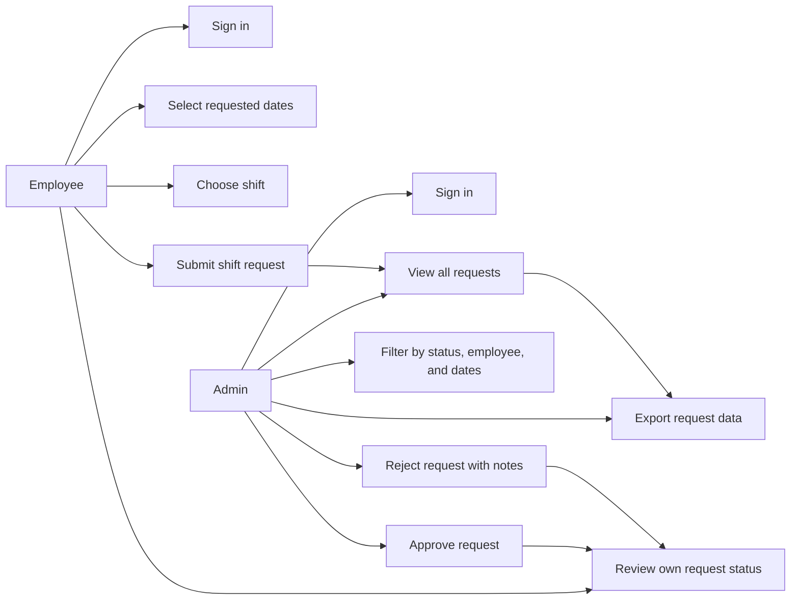
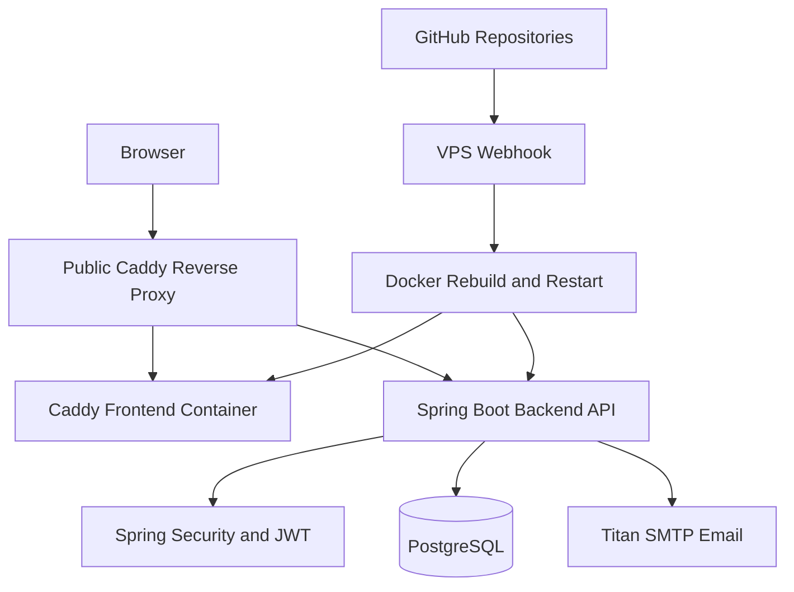
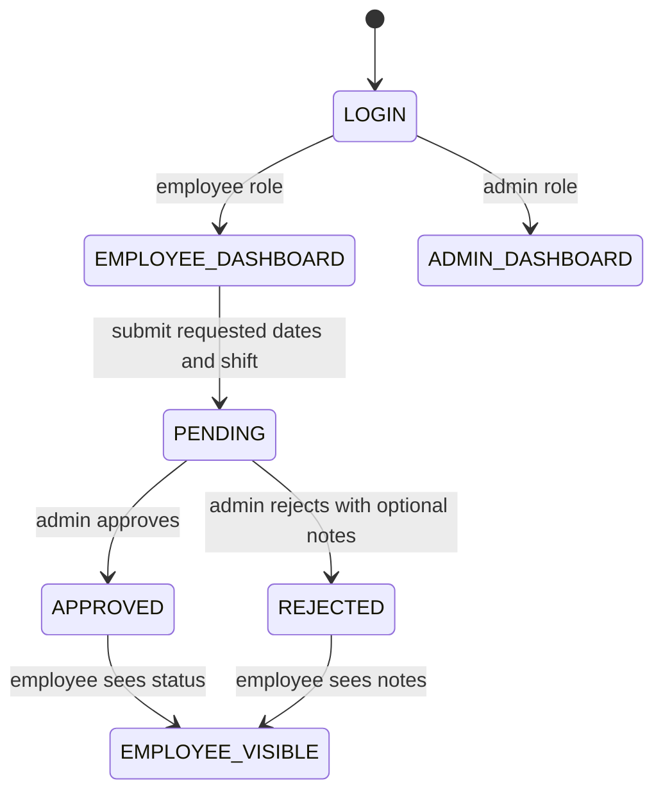
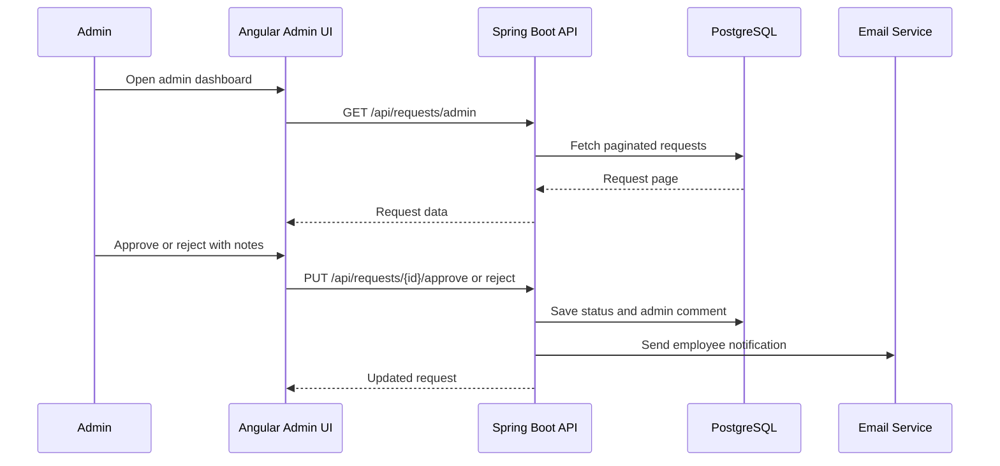
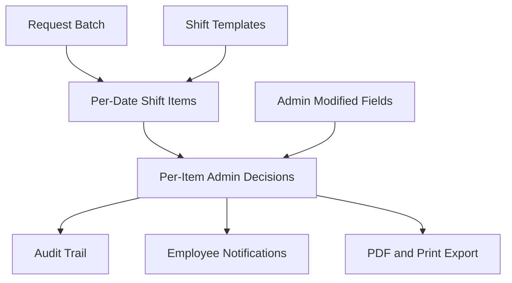

# Shift Scheduler App Frontend

## Plain-English Overview

Shift Scheduler App is a full-stack scheduling platform built to replace a manual
"Request for Hours" paper workflow.

Instead of employees writing requested dates and shifts on a PDF form, the app lets
employees submit requests from the browser and lets administrators review, approve,
reject, comment on, filter, and export those requests from a central dashboard.

The project is split into two repositories:

- a Spring Boot backend for authentication, role checks, business rules, APIs, persistence, and notifications
- an Angular frontend for employee request entry, admin review, exports, and day-to-day user interaction

This repository contains the Angular frontend.

Live deployment:

- `https://schedule.samuelkawuma.com/login`

## Visual Reading Guide

If someone is new to the project, the fastest way to understand it is to read this
README in this order:

- start with the use case diagram to see who uses the platform and why
- move to the high-level architecture diagram to understand the deployed shape
- review the shift request lifecycle to understand how requests move through the system
- finish with the PDF-form alignment roadmap to see how the product is evolving toward the original paper workflow

## Portfolio Snapshot

This project is strongest when explained from both a business and engineering angle:

- business problem: employees request available work hours through a manual PDF process that is slow to review, difficult to track, and hard to audit
- product solution: one shared shift request platform with employee submission, admin review, status decisions, comments, and export support
- engineering value: JWT authentication, role-based routing, backend authorization, PostgreSQL persistence, Docker deployment, and a webhook-driven VPS release flow
- operational value: cleaner request intake, faster admin decisions, better visibility, fewer manual handoffs, and a foundation for audit-friendly approvals

## Why This Project Exists

The original workflow depended on a manually completed "Request for Hours" form.
That creates a familiar set of operational problems:

- employees must fill out and submit requests outside the scheduling system
- administrators must manually interpret requested dates, shifts, and notes
- approval decisions are hard to trace later
- changes or denials can be communicated inconsistently
- reports and exports require extra manual work
- the process does not naturally produce audit history

Shift Scheduler App turns that paper process into a structured workflow with clear
roles, authenticated users, request status, admin notes, and exportable request data.

## Use Case Diagram



## Core Capabilities

### Employee Shift Requests

- employee login and registration
- protected employee dashboard
- multi-date request selection
- shift selection
- duplicate prevention handled by the backend
- personal request history
- visible request status and admin comments

### Admin Review

- protected admin dashboard
- paginated request listing
- status filtering
- employee ID search
- date range filtering
- approve and reject actions
- admin comments on decisions
- selected-row or filtered-list export

### Export And Reporting

- CSV export for filtered request data
- Excel-compatible `.xls` export without vulnerable spreadsheet dependencies
- timestamped filenames for cleaner recordkeeping

### Security Foundations

- JWT-based login
- route guards for employee and admin screens
- auth interceptor for API calls
- backend `@PreAuthorize` role checks
- employee identity derived from the authenticated JWT on protected backend request APIs

## Why This Project Stands Out

- it comes from a real manual scheduling workflow, not a generic CRUD example
- it separates employee request intake from admin review responsibilities
- it treats the backend as the authority for user identity and request rules
- it already has a practical deployment path through GitHub, a webhook, Docker, and a VPS
- it has a clear roadmap back to the original signed PDF form

## High-Level Architecture Diagram



## Repository Layout

```text
shiftRequest_App/
|- shiftApp_frontend/
|  `- shiftApp-frontend/
|     |- README.md
|     |- Dockerfile
|     |- Caddyfile
|     `- src/app/...
`- shiftApp_Backend/
   `- Shift-App/
      |- ReadMe.md
      |- Dockerfile
      `- src/main/java/com/skawuma/shiftapp/...
```

Public repositories:

- frontend: `https://github.com/skawuma/shiftApp-frontend`
- backend: `https://github.com/skawuma/Shift_App`

## High-Level Technical View

### Frontend

- Angular 20 standalone component structure
- Angular Material UI for forms, tables, dialogs, date pickers, snackbars, and pagination
- role-aware routes for employee and admin dashboards
- JWT-aware HTTP calls through the request service and auth interceptor
- CSV and Excel-compatible exports implemented in the browser

### Backend

- Spring Boot REST API
- Spring Security with JWT authentication
- role checks enforced at the controller layer
- service-layer validation for shift request submission and duplicate prevention
- PostgreSQL persistence through Spring Data JPA
- email notification support when admin decisions are saved

### Infrastructure

- Dockerfile for Angular build and Caddy hosting
- Dockerfile for Spring Boot packaging and runtime
- GitHub push triggers the VPS webhook
- webhook rebuilds and restarts Docker containers on the VPS
- production frontend is served under `schedule.samuelkawuma.com`
- production API is served under `api-schedule.samuelkawuma.com`

## Shift Request Lifecycle

This is the current operational heartbeat of the platform.



## Admin Review Flow



## Current-State Architecture

Today, Shift Scheduler App is a practical full-stack application:

- Angular handles login, guarded navigation, employee request entry, admin review, filtering, selection, and export
- Spring Boot handles authentication, authorization, request validation, persistence, and decision notifications
- PostgreSQL stores users and shift requests
- Docker packages the frontend and backend for VPS deployment

The current interaction model is intentionally simple:

- REST handles authentication, request submission, listing, approval, rejection, and export data
- JWT protects application sessions and API access
- GitHub plus webhook automation handles deployment updates

## Future-State Architecture

The next stage should align more closely with the original signed PDF form and make
the review process more precise.



Future backend modules can stay inside the current Spring Boot app until scale
requires a split. A future event-driven layer could be added later for real-time
notifications, reporting, or scheduling analytics, but it is not required for the
current stage.

## PDF-Form Alignment Roadmap

The original "Request for Hours" form is the product reference point. Upcoming
sprints should add these concepts in order:

- request batch object with employee name, submitted date, mandatory hours, voluntary hours, and multiple row items
- per-date and per-shift decisions: `APPROVED_AS_REQUESTED`, `APPROVED_WITH_MODIFICATION`, and `DENIED_WITH_NOTES`
- admin-modified approval fields: approved shift, approved time, admin notes, and decision date
- shift templates matching the form: `7am-3pm`, `3pm-11pm`, `3pm-9pm`, `11pm-7am`, and `11pm-9am`
- PDF and print export that recreates the signed "Request for Hours" form
- audit trail for submitted by, reviewed by, changed from/to, and timestamps
- employee notifications for approved, modified, or denied requests

## Sprint Progress Snapshot

### Completed Foundation

- Angular frontend and Spring Boot backend repositories created
- login and registration flows
- employee and admin dashboards
- request submission with multiple dates
- admin approval and rejection
- CSV and Excel-compatible export
- Docker deployment path

### Security Hardening Sprint

- duplicate controller mapping fixed
- backend role checks added with `@PreAuthorize`
- employee identity derived from JWT authentication for protected request APIs
- destructive `create-drop` database behavior replaced with safer schema update configuration
- vulnerable frontend dependencies upgraded
- browser-side spreadsheet export rewritten without vulnerable packages

### Current Documentation And Test Cleanup Sprint

- root app component spec restored and aligned with the actual `AppComponent`
- Karma test configuration updated for Angular 20 and Zone.js testing
- frontend README rewritten as a portfolio-ready project overview
- backend README added with implementation-focused setup and architecture notes

### Next Product Sprint

- introduce the request batch model
- model request rows separately from the batch
- add PDF-form shift templates
- expand admin decisions from simple approved/rejected to per-row outcomes

## Suggested Demo Story

If you are walking someone through the project, this is a strong and simple narrative:

1. Start with the manual "Request for Hours" problem.
2. Show the employee dashboard and submit a multi-date shift request.
3. Switch to the admin dashboard and filter the pending requests.
4. Approve or reject a request with notes.
5. Export the request list.
6. Explain how the next sprint will recreate the original signed PDF form as a digital batch workflow.

## Audience Guide

- non-technical stakeholders: focus on the business problem, use case diagram, lifecycle, and PDF-form roadmap
- developers: review the frontend and backend technical views, setup commands, and controller/service structure
- reviewers and interviewers: use the diagrams and sprint snapshot to understand how the app maps a real manual workflow into software

## Running Locally

Install dependencies:

```bash
npm install
```

Start the Angular development server:

```bash
npm start
```

The frontend runs at:

- `http://localhost:4200`

The backend should be running separately at:

- `http://localhost:8080`

## Build

```bash
npm run build
```

Production output is written to:

- `dist/shiftApp-frontend`

## Tests

Run the Angular/Karma test suite:

```bash
npx ng test --watch=false --browsers=ChromeHeadless
```

Run only the root app shell spec:

```bash
npx ng test --watch=false --browsers=ChromeHeadless --include src/app/app.spec.ts
```

## Docker

```bash
docker build -t shift-frontend .
docker run -p 4200:80 shift-frontend
```

## Environment Notes

The local API base URL is configured in:

- `src/app/environments/environment.ts`

The production Dockerfile can inject the deployed API URL into the Angular build:

```bash
docker build \
  --build-arg API_URL=https://api-schedule.samuelkawuma.com/api \
  -t shift-frontend .
```

## Documentation Map

- frontend repository: `https://github.com/skawuma/shiftApp-frontend`
- backend repository: `https://github.com/skawuma/Shift_App`
- deployed application: `https://schedule.samuelkawuma.com/login`

## Closing Summary

Shift Scheduler App is more than a shift-request table. It is a digital replacement
for a real paper scheduling workflow: request, review, decide, notify, export, and
eventually reproduce the original signed form with stronger auditability.

The architecture is intentionally practical:

- simple enough to deploy and reason about quickly
- structured enough to protect role-based workflows
- flexible enough to grow into request batches, PDF export, richer decision states, audit trails, and employee notifications
